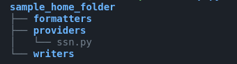

# ODSynth

ODSynth generates samples of synthetic data for you, based on the expected schema of your data. This project may be used for generating data for:
* Seeding your ETL applications
* Benchmarking of ETL applications
* Producing data in various formats (json, delimited text, xml, etc)

With the plugin system, developers can use their 'providers' locally in their own applications.

## How it works
1. Specify a schema. [See an example here](./sample_schema/flat_schema.yaml). The providers specify the type of data to be generated. (For example `first_name`, `last_name` etc.)
1. Use the schema to **generate data** in memory or **publish data** to disc or other medium

## Installation
A proper python package for this application is not yet available, so users must download and install this package locally

```sh
git clone https://github.com/kbaafi/data-synthesizer.git
cd data-synthesizer
# Optional
# python -m venv venv
pip install -e .
```
## Basic Usage
### Use 'synth' to generate json data
`synth --schema-spec-file=../schema.yaml --format=json --num-samples=3`
### Use 'synth' to generate csv data
`synth --schema-spec-file=../flat_schema.yaml --format=txt --num-samples=3 --formatter-arg delimiter=comma`

Delimiter may be one of 'comma', 'tab' or 'pipe'

### Use 'publish' to load synthetic data to local disc in XML format
Publish 100 samples of schema specified in `flat_schema.yaml`, 10 examples per batch.

`publish --schema-spec-file=../flat_schema.yaml --format=xml --writer=local_disc --writer-arg output_dir=../odsynth_out --num-samples=100 --batch-size=10`

> For more on the data generator and the data publisher, see the help pages for synth and publish
`publish --help` or `synth --help`

## Schemas and Providers
An example schema is shown below. This schema simulates the scenario of a parent responsible for up to 5 children. Providers are responsible for generating the primitive fields that comprise the record. [An example of a provider that generates a random integer can be found here](./odsynth/providers/random_int.py)
```yaml
fields:
  parent_firstname:
    provider: first_name
  parent_lastname:
    provider: last_name
  children:
    fields:
      firstname:
        provider: first_name
      lastname:
        provider: last_name
    max_count: 5
    is_array: true
  parent_age:
    provider: random_int
    provider_args:
      min: 25
      max: 55
  parent_ssn:
    provider: ssn
```
This schema is expected generated a data point that looks like this:

```json
{
    "parent_first_name": "Christopher", "parent_lastname": "Villegas",
    "children": [
        {"firstname": "Jason", "lastname": "Rogers"},
        {"firstname": "Andrea", "lastname": "Young"},
        {"firstname": "Michelle", "lastname": "Kaiser"}
    ],
    "parent_age": 43,
    "parent_ssn": "269-11-8507"
}
```

Currently ODSynth implements the following Providers based on Faker
* First Name
* Last Name
* Text
* Random Integer
* Social Security Number

We hope to be able to develop more Providers in the future.
## Formatters
Generated data can be formatted into the following formats for use in memory or storage on disc:
* Json
* XML
* Delimited Text (csv, tsv, pipe delimited)
* Pandas

## Writers
Writers work with the publishing system to write generated data to a specified medium. Currently the **local_dics** writer has been implemented.

## The Provider Plugin System and the ODSYNTH_HOME
It is possible for developers to plugin in their own providers, formatters and writers to the Data Synthesis system by loading the user added components from the **ODSYNTH_HOME** directory.  The ODSYNTH_HOME is  specified by setting the environment variable `ODSYNTH_HOME`

```sh
export ODSYNTH_HOME=./sample_home_folder
```




The plugins system will load all providers, formatters and writers from ./sample_home_folder and in this case the **ssn.py** provider plugin will be included as a provider for data synthesis.

# Development Roadmap
* [x] Build Data Formatter for Pandas
* [x] Build Data Formatter for XML
* [x] Build Data Writer for XML
* [x] Build Data Formatter for JSON
* [x] Build Data Writer for JSON
* [x] Build Formatter for Delimited Text
* [ ] Add a logger (Under consideration)
* [ ] Add some form of support for Py Faker's Locales
* [x] Improve DOM Validation (Ongoing)
* [ ] Data Transformer for Spark
* [ ] Add support for optional fields
* [ ] Build Data Writers for:
    * [ ] S3
    * [ ] Kafka
    * [ ] (Possibly) to REST APIs
* [ ] Implement a plugin system for users to add their own code(Providers, Writers and Transformers) in their own local system
* [ ] (Possibly) Add examples for Dockerized deployment of Publishers
* [ ] Add Code and User documentation
* [ ] Add CICD Pipeline for deploying python package to PyPi
* [ ] Improve Local Python Packaging
